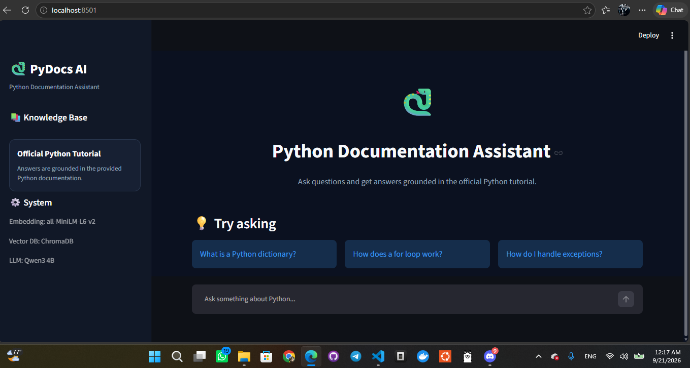
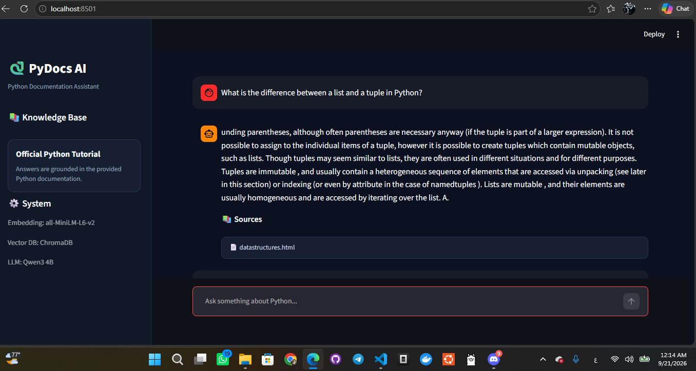
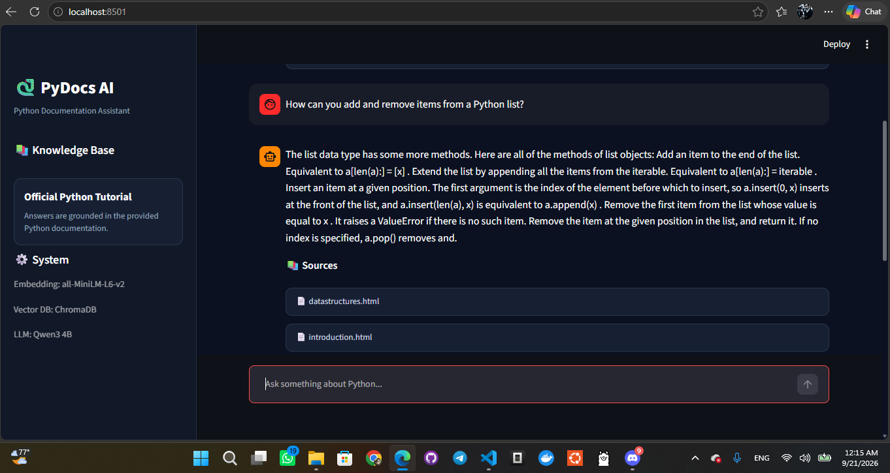
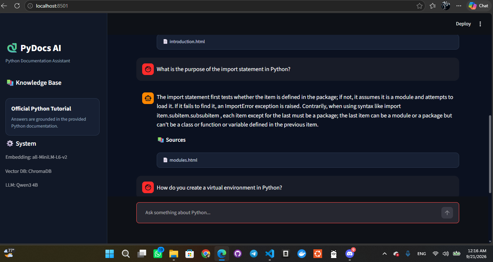
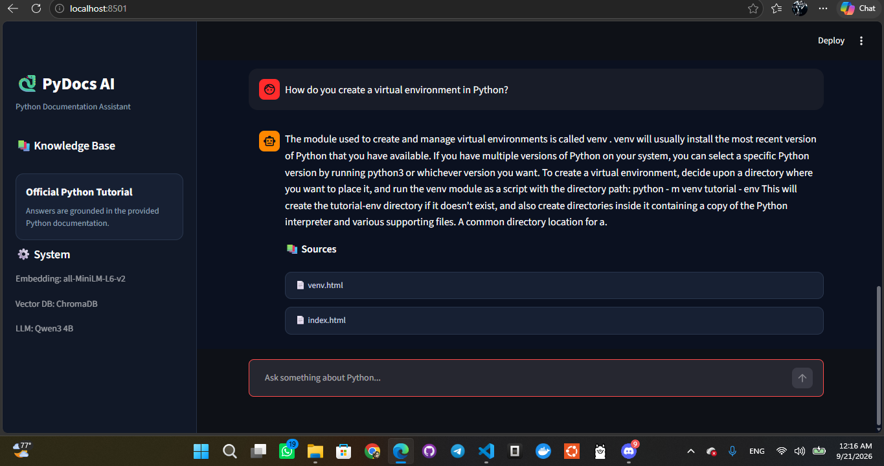

\# Python RAG Document Assistant


A Retrieval-Augmented Generation (RAG) document assistant for learning Python using the official Python 3.10 Tutorial as the knowledge base.


The system retrieves relevant sections from the Python documentation and uses a local Large Language Model (LLM) to generate grounded answers with source references.


\---


\## 1. Project Overview


This project was developed as an \*\*ITI Level 2 Summer Training Graduation Project\*\*.


The main goal is to build a document-based question answering assistant using a complete RAG pipeline.


Instead of allowing the language model to answer only from its general knowledge, the system:


1\. Receives a user question.

2\. Converts the question into an embedding.

3\. Searches the persisted vector database.

4\. Retrieves the most relevant documentation chunks.

5\. Sends the retrieved context to the local LLM.

6\. Generates an answer grounded in the retrieved documentation.

7\. Returns the answer together with the source documents.


\### Domain


\*\*Python Programming\*\*


\### Knowledge Source


\*\*Official Python 3.10 Tutorial\*\*


The corpus contains 17 HTML documents covering Python programming topics such as:


\* Introduction to Python

\* Control flow

\* Data structures

\* Functions

\* Modules

\* File input/output

\* Errors and exceptions

\* Classes

\* The Python interpreter

\* Virtual environments

\* Standard library topics


\---


\## 2. Main Features


\* HTML document loading and cleaning

\* Section-aware document chunking

\* Semantic embeddings

\* Persistent ChromaDB vector store

\* Top-k semantic retrieval

\* Retrieval-Augmented Generation

\* Local LLM inference using Ollama

\* Source-grounded answers

\* FastAPI backend

\* Streamlit frontend

\* API validation and error handling

\* Automated backend tests

\* Retrieval evaluation using 10 questions

\* Exported RAG configuration

\* Persisted vector database


\---


\## 3. Architecture


```text

                    +----------------------+

                    |        User          |

                    +----------+-----------+

                               |

                               v

                    +----------------------+

                    | Streamlit Frontend   |

                    |      app.py          |

                    +----------+-----------+

                               |

                               | HTTP POST /query

                               v

                    +----------------------+

                    |    FastAPI Backend   |

                    +----------+-----------+

                               |

                               v

                    +----------------------+

                    |     Retrieval        |

                    | Sentence Transformers|

                    +----------+-----------+

                               |

                               v

                    +----------------------+

                    |      ChromaDB        |

                    | Persistent Vector DB |

                    +----------+-----------+

                               |

                               | Top-k chunks

                               v

                    +----------------------+

                    |  Retrieved Context   |

                    +----------+-----------+

                               |

                               v

                    +----------------------+

                    |   Ollama / Qwen3     |

                    |      Local LLM       |

                    +----------+-----------+

                               |

                               v

                    +----------------------+

                    | Grounded Answer +    |

                    | Source References    |

                    +----------------------+

```


\---


\## 4. RAG Pipeline


\### Step 1: Document Loading


The official Python tutorial HTML files are loaded from the document corpus.


BeautifulSoup is used to parse the HTML files.


Unnecessary elements such as:


\* `script`

\* `style`

\* `nav`

\* `header`

\* `footer`

\* `aside`


are removed before extracting the useful documentation content.


\---


\### Step 2: Text Cleaning


The extracted text is cleaned by:


\* Removing unnecessary whitespace

\* Removing empty lines

\* Normalizing spacing

\* Preserving documentation structure

\* Preserving section headings

\* Preserving code examples


The final corpus contains \*\*17 HTML documents\*\* and approximately \*\*260,000 characters\*\* of cleaned documentation text.


\---


\### Step 3: Chunking Strategy


A \*\*section-aware chunking strategy\*\* is used.


Configuration:


| Parameter          |           Value |

| ------------------ | --------------: |

| Maximum chunk size | 1200 characters |

| Chunk overlap      |  150 characters |

| Number of chunks   |             332 |

| Average chunk size | \~824 characters |


Each chunk keeps its corresponding documentation section.


Example:


```text

Section: 5.5. Dictionaries


\[retrieved documentation content]

```


\### Why Section-Aware Chunking?


Section-aware chunking was selected because the Python tutorial is highly structured.


Keeping section headings with the chunk helps the retrieval system preserve the relationship between:


\* The topic

\* The documentation section

\* The actual explanation


This improves source identification and makes retrieved context easier for the generation model to understand.


\---


\## 5. Embeddings


The project uses:


\*\*Sentence Transformers — `all-MiniLM-L6-v2`\*\*


Embedding dimension:


\*\*384\*\*


Each documentation chunk is converted into a numerical vector.


The same embedding model is used for user questions during retrieval.


\---


\## 6. Vector Database


The project uses:


\*\*ChromaDB\*\*


The vector store is persisted locally so that the embeddings do not need to be recreated every time the application starts.


Collection name:


```text

python\_tutorial\_v2

```


Stored metadata includes:


\* Source filename

\* Documentation section

\* Chunk ID


Vector store location:


```text

backend/data/vector\_store/chroma\_db\_v2

```


\---


\## 7. Retrieval


For every user question:


1\. The question is converted into an embedding.

2\. ChromaDB performs semantic similarity search.

3\. The most relevant chunks are retrieved.

4\. The retrieved chunks are combined into a context.

5\. The context is passed to the generation model.


Default retrieval configuration:


```text

Top K = 3

```


Example:


```text

Question:

What is a Python dictionary?


Retrieved section:

5.5. Dictionaries


Source:

datastructures.html

```


\---


\## 8. Generation


The project uses:


\*\*Qwen3 4B\*\*


The model runs locally through:


\*\*Ollama\*\*


The generation prompt instructs the model to use the retrieved documentation as the source of information.


The application is designed to keep answers grounded in the retrieved documentation instead of relying only on the model's general knowledge.


\---


\## 9. Source Grounding


The backend returns both:


```json

{

  "answer": "Generated answer...",

  "sources": \[

    "datastructures.html"

  ]

}

```


This allows the user to see which documentation files were used to support the answer.


\---


\## 10. Backend


The backend is implemented using \*\*FastAPI\*\*.


\### Backend Structure


```text

backend/

├── app/

│   ├── main.py

│   ├── api/

│   │   └── routes/

│   │       └── query.py

│   ├── core/

│   │   └── config.py

│   ├── schemas/

│   │   └── query.py

│   ├── services/

│   │   ├── retrieval.py

│   │   └── generation.py

│   └── utils/

├── data/

│   └── vector\_store/

│       └── chroma\_db\_v2/

├── tests/

│   └── test\_api.py

└── requirements.txt

```


\### API Endpoints


\#### Health Check


```http

GET /health

```


Response:


```json

{

  "status": "ok"

}

```


\#### Query


```http

POST /query

```


Request:


```json

{

  "question": "What is a Python dictionary?"

}

```


Response:


```json

{

  "answer": "Generated answer based on the retrieved Python documentation.",

  "sources": \[

    "datastructures.html"

  ]

}

```


\---


\## 11. Frontend


The user interface is implemented using \*\*Streamlit\*\*.


The frontend provides:


\* Chat-style question interface

\* User question input

\* Generated answer display

\* Source display

\* Loading state

\* Error handling

\* Backend API communication


The frontend communicates with the FastAPI backend through `api\_client.py`.


\### Frontend Structure


```text

frontend/

├── app.py

├── api\_client.py

└── requirements.txt

```


\---


\## 12. Project Structure


```text

ITI RAG\_Project/

│

├── backend/

│   ├── app/

│   │   ├── main.py

│   │   ├── api/

│   │   │   └── routes/

│   │   │       ├── query.py

│   │   │       └── \_\_init\_\_.py

│   │   ├── core/

│   │   │   └── config.py

│   │   ├── schemas/

│   │   │   └── query.py

│   │   ├── services/

│   │   │   ├── retrieval.py

│   │   │   └── generation.py

│   │   └── utils/

│   ├── data/

│   │   └── vector\_store/

│   │       └── chroma\_db\_v2/

│   ├── tests/

│   │   └── test\_api.py

│   └── requirements.txt

│

├── frontend/

│   ├── app.py

│   ├── api\_client.py

│   └── requirements.txt

│

├── notebooks/

│   └── rag\_pipeline.ipynb

│

├── evaluation/

│

├── ITI\_Final\_pro\_RAG.ipynb

├── rag\_config.json

├── retrieval\_evaluation.csv

├── chroma\_db\_v2.zip

├── test\_local\_retrieval.py

├── test\_rag\_generation.py

├── .env.example

├── .gitignore

└── README.md

```


\---


\## 13. Technologies Used


| Component            | Technology            |

| -------------------- | --------------------- |

| Programming Language | Python                |

| RAG Framework        | Custom RAG Pipeline   |

| Embeddings           | Sentence Transformers |

| Embedding Model      | all-MiniLM-L6-v2      |

| Vector Database      | ChromaDB              |

| LLM                  | Qwen3 4B              |

| Local LLM Runtime    | Ollama                |

| Backend              | FastAPI               |

| Frontend             | Streamlit             |

| HTML Parsing         | BeautifulSoup         |

| Testing              | Pytest                |

| Data Processing      | Pandas                |


\---


\## 14. Configuration


The project configuration is stored in:


```text

rag\_config.json

```


Main configuration:


```text

Embedding Model:

all-MiniLM-L6-v2


Vector Store:

ChromaDB


Collection:

python\_tutorial\_v2


Chunking:

Section-aware


Chunk Size:

1200 characters


Chunk Overlap:

150 characters


Top K:

3


Domain:

Python Programming


Source:

Official Python 3.10 Tutorial

```


\---


\## 15. Environment Variables


Environment variables are stored locally in `.env`.


The `.env` file must not be committed to GitHub.


Example configuration:


```text

BACKEND\_URL=http://127.0.0.1:8000

OLLAMA\_URL=http://127.0.0.1:11434/api/chat

OLLAMA\_MODEL=qwen3:4b

```


A template is provided in:


```text

.env.example

```


\---


\## 16. Installation


\### Create Virtual Environment


```powershell

python -m venv .venv

```


Activate it:


```powershell

.venv\\Scripts\\Activate.ps1

```


\### Install Backend Dependencies


```powershell

pip install -r backend/requirements.txt

```


\### Install Frontend Dependencies


```powershell

pip install -r frontend/requirements.txt

```


\### Install Testing Dependency


```powershell

pip install pytest

```


\---


\## 17. Running the Project


\### Step 1: Start Ollama


Make sure Ollama is running and the configured model is available.


The configured model is:


```text

qwen3:4b

```


\---


\### Step 2: Start FastAPI


From the project root:


```powershell

$env:PYTHONPATH="."

uvicorn backend.app.main:app --host 127.0.0.1 --port 8000

```


The backend will be available at:


```text

http://127.0.0.1:8000

```


\---


\### Step 3: Start Streamlit


Configure the backend URL:


```powershell

$env:BACKEND\_URL="http://127.0.0.1:8000"

```


Then run:


```powershell

streamlit run frontend/app.py

```


\---


\## 18. API Testing


\### Health Check


```powershell

curl http://127.0.0.1:8000/health

```


Expected response:


```json

{

  "status": "ok"

}

```


\### Query Example


```powershell

curl -X POST http://127.0.0.1:8000/query `

  -H "Content-Type: application/json" `

  -d "{\\"question\\":\\"What is a Python dictionary?\\"}"

```


\---


\## 19. Automated Tests


The backend includes two automated API tests.


\### Test 1


Tests:


```text

GET /health

```


\### Test 2


Tests:


```text

POST /query

```


The tests verify:


\* HTTP status

\* Response structure

\* Answer existence

\* Sources existence

\* Sources returned as a list


Run the tests:


```powershell

$env:PYTHONPATH="."

pytest backend/tests/test\_api.py -v

```


Current result:


```text

test\_health PASSED

test\_query  PASSED


2 passed

```


\---


\## 20. Retrieval Evaluation


The retrieval pipeline was evaluated using \*\*10 questions\*\* covering different parts of the official Python tutorial.


Evaluation questions include:


1\. What is a Python list?

2\. How does a for loop work in Python?

3\. What is a Python dictionary?

4\. How do you handle exceptions in Python?

5\. What is a Python class?

6\. How do you define a function in Python?

7\. How can you read and write files in Python?

8\. What are list comprehensions in Python?

9\. What is a virtual environment in Python?

10\. How does Python import modules?


The expected documentation sections were compared against the retrieved results.


\### Retrieval Result


\*\*Top-5 retrieval accuracy: 100%\*\*


The detailed evaluation is stored in:


```text

retrieval\_evaluation.csv

```


\---


\## 21. Evaluation Artifacts


The project includes:


```text

rag\_config.json

```


Contains the main RAG configuration.


```text

retrieval\_evaluation.csv

```


Contains the retrieval evaluation results.


```text

chroma\_db\_v2.zip

```


Contains the persisted ChromaDB vector store exported from the notebook.


\---


\## 22. Notebook


The complete RAG pipeline is documented in:


```text

ITI\_Final\_pro\_RAG.ipynb

```


The notebook includes:


1\. Document loading

2\. HTML parsing

3\. Text cleaning

4\. Chunking

5\. Chunking strategy explanation

6\. Embedding generation

7\. ChromaDB creation

8\. Semantic retrieval

9\. Context construction

10\. RAG prompt construction

11\. Retrieval testing

12\. Evaluation

13\. Configuration export

14\. Vector store export


\---


\## 23. Screenshots

The frontend was tested with multiple Python questions using the Streamlit interface.

### Main Interface


### Retrieval / RAG Example


### Question Example 2


### Question Example 3


### Question Example 4

## 24. Error Handling


The application handles backend/API errors and displays an appropriate error message in the frontend.


The FastAPI backend also validates incoming query requests using Pydantic schemas.


\---


\## 25. Security and Git Hygiene


The following files are excluded from Git:


```text

.venv/

.env

\_\_pycache\_\_/

\*.pyc

\*.log

.DS\_Store

```


The `.env` file must never be committed because it contains local configuration.


\---


\## 26. Extended Track / Future Work


The project structure can be extended with computer vision functionality.


A possible Extended Track implementation is:


```text

User uploads an image

        |

        v

YOLO Object Detection

        |

        v

Detected objects / regions

        |

        v

RAG Retrieval

        |

        v

LLM-generated explanation

```


This can allow the assistant to combine document retrieval with image-based information.


The current implementation focuses on completing the core RAG pipeline.


\---


\## 27. Limitations


\* The knowledge base is limited to the selected Python 3.10 Tutorial documents.

\* Answers depend on the quality of retrieved documentation chunks.

\* The local LLM runs on the available local hardware.

\* The current system focuses on text-based document question answering.

\* The Extended YOLO functionality is planned as an additional extension.


\---


\## 28. Project Deliverables


The final project includes:


\* RAG notebook

\* Persisted vector database

\* RAG configuration

\* Retrieval evaluation

\* FastAPI backend

\* Streamlit frontend

\* Backend tests

\* Requirements files

\* Environment template

\* Git ignore configuration

\* Project documentation

\* Screenshots


\---


\## 29. Conclusion


This project demonstrates a complete end-to-end Retrieval-Augmented Generation system for Python documentation.


The system combines:


\*\*Document Processing → Chunking → Embeddings → Vector Search → Context Retrieval → Local LLM Generation → Source-Grounded Answer\*\*


The implementation provides a practical document assistant that can answer Python learning questions using the official Python tutorial as its retrieval knowledge base.


\---


\## 30. Project Information


\*\*Training:\*\* ITI Level 2 Summer Training


\*\*Project Type:\*\* RAG-Powered Document Assistant


\*\*Domain:\*\* Python Programming


\*\*Primary Technologies:\*\* Python, FastAPI, Streamlit, ChromaDB, Sentence Transformers, Ollama, Qwen3


\*\*Retrieval Evaluation:\*\* 100% Top-5 accuracy on 10 evaluation questions


